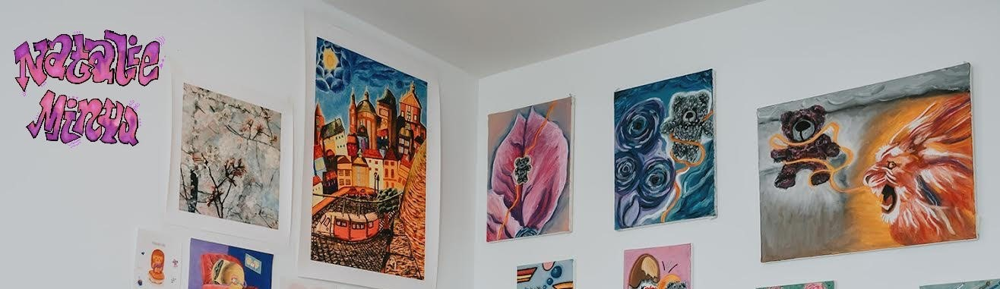

<div align="center">



# ✧˖° Greetings, I'm natstar 🎀 °˖✧

<div align="center">
  <a href="https://getsieve.page"></a>
  <a href="https://natalieminyu.com/"></a>
  <a href="https://www.linkedin.com/in/natalieminyu/"></a>
  <a href="https://instagram.com/natalieminyu"></a>
</div>

<br>

```txt
✧ ⋆ ┈ ˚. natstarmenu ˚ ┈ ⋆ ✧
✿ gamertag & online alias ✿
```

---

### 🌸 About Me 🌸

```txt
⋆˙⟡♡ Founder @ Sieve Page - Empowering Artists to Thrive ♡⟡˙⋆
```

### ✧ Journey ✧

🎨 **Art & Tech**
- Traditional pastels → Digital art → Tech-enabled art
- Currently exploring pottery projects ✿
- Building [Sieve Page](https://getsieve.page) to help artists manage their work 💖

📊 **Quant Background**
- Learned web programming @ NYU
- Built debt models & waterfall recovery models for restructuring

💼 **Business Experience**
- Corporate finance & advisory for hedge funds and corporates
- Art, media, entertainment & gaming/tech
  
### ✿ Tech Garden ✿

```txt
⋆˙⟡♡ Crafting Sieve Page with Love ♡⟡˙⋆
Supporting artists in their creative journey
```

### 🎀 Say hi 🎀

<div align="center">
  
★ [Sieve Page](https://getsieve.page) ⋆ [Website](https://natalieminyu.com/) ⋆ [LinkedIn](https://www.linkedin.com/in/natalieminyu/) ⋆ [Instagram](https://instagram.com/natalieminyu) ★

</div>

</div>
