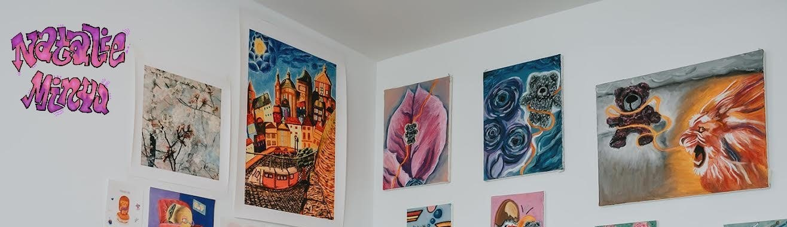

<div align="center">



# ˖° Greetings, I'm Natalie °˖

<br>

```txt
✧ ⋆ ┈ ˚. natstarmenu ˚ ┈ ⋆ ✧
 gamertag & online alias 
```
### About Me

Founder, Etoile Foundry, Inc. (Seed-strapped)

```txt
⋆˙⟡♡ Mission: Building modern infrastructure for media businesses ♡⟡˙⋆
```
### ✧ Building ✧

- [SievePage](https://getsieve.page): Creator workflow platform for Etoile's data sovereignty stack
- [Temerity](https://temerity.io): Asset security infrastructure for media

### ✧ Journey ✧

🎨 **Art & Tech**
- Traditional pastels → Digital art → on-chain 1/1s and collections
- Commissions and exhibitions: Oculus WTC, Miami Art Week (AR), Solana Hacker House

📊 **Quant Background**
- BA in Economics @ NYU; minor in Web Programming & Applications
- Built debt models & waterfall recovery models for restructuring & litigation
- Operational Sybil resistance and MEV mitigation across primary & secondary markets

💼 **Business Experience**
- Corporate finance & advisory for hedge funds and distressed companies
- IP acquisition & monetization at Lionsgate Motion Pictures and HarperCollins
  


### Research & Security

⋆˙⟡♡ Current Focus: Automated agent detection for media pipelines ♡⟡˙⋆

```txt
Applying adversarial modeling experience to automated agent pipelines targeting proprietary media.
```

<br>


<div align="center">
  <a href="https://getsieve.page"></a>
  <a href="https://www.linkedin.com/in/natalieminyu/"></a>
  <a href="https://natalieminyu.com/"></a>
  <a href="https://instagram.com/natalieminyu"></a>
</div>

<br>

</div>
